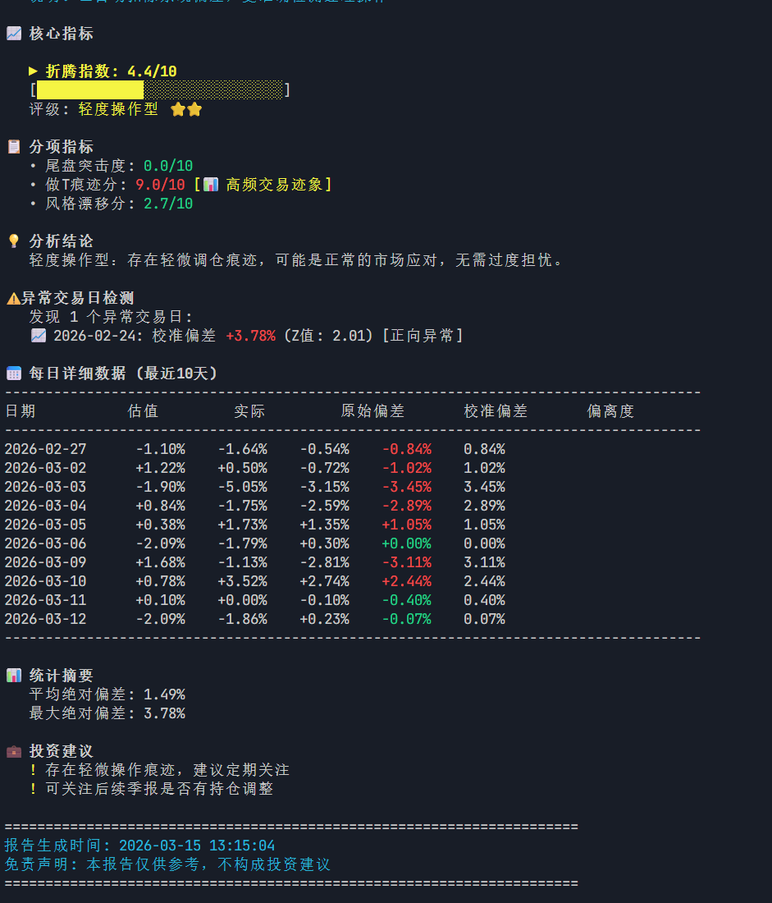

# 🔬 FundXray

> **让基民看清"季报是过去的照片，而我在检测经理现在的动作"**

**基金透视仪** — 帮你识别基金经理是否在"瞎折腾"你的投资



---

## 🤔 这个项目解决什么问题？

### 场景1：你买了基金，但不知道经理在干嘛
- 季报显示持仓茅台、腾讯，但你不知道现在是否还持有
- 基金净值涨跌和估值对不上，怀疑经理偷偷调仓
- **FundXray 能告诉你**：经理最近有没有偷偷操作

### 场景2：季末业绩排名，经理可能"作弊"
- 季末最后几天，经理可能临时买入涨得好的股票粉饰业绩
- 这种操作对长期投资者没有好处
- **FundXray 能检测**：是否有"尾盘突击"行为

### 场景3：经理频繁交易，但收益原地踏步
- 有些经理喜欢频繁买卖（做T），但长期收益并不理想
- 频繁交易增加成本，损害投资者利益
- **FundXray 能识别**：是否存在过度交易痕迹

### 场景4：基金风格漂移，和你预期不符
- 你买的是消费主题基金，但经理偷偷买了新能源
- 这种风格漂移增加了投资风险
- **FundXray 能发现**：持仓风格是否发生系统性变化

---

## 📊 什么是"折腾指数"？

简单来说：**折腾指数越高，说明基金经理操作越频繁，可能存在不当行为**

| 分数 | 含义 | 你的应对 |
|------|------|---------|
| 0-3分 ⭐⭐⭐ | **老实持有型** | 放心持有，经理很老实 |
| 3-5分 ⭐⭐ | **轻度操作型** | 正常波动，无需担心 |
| 5-7分 ⭐ | **中度折腾型** | 关注季报，看看是否有变化 |
| 7-10分 ⚠️ | **高度折腾型** | 警惕！经理可能在瞎折腾 |

---

## 💡 核心价值

FundXray 通过对比**基金实际净值**和**根据持仓估算的净值**，发现两者之间的差异：

- **差异小** → 经理基本没动，和季报一致 ✅
- **差异大** → 经理可能在偷偷调仓 ⚠️

### 三种"折腾"行为检测

| 行为 | 通俗解释 | 对投资者的影响 |
|------|---------|---------------|
| 🎯 **尾盘突击** | 季末临时买入涨得好的股票，让业绩好看 | 短期粉饰，长期无益 |
| 📊 **频繁做T** | 每天频繁买卖，但总体收益没提高 | 增加交易成本，损害收益 |
| 🔄 **风格漂移** | 实际买的和季报说的不是一回事 | 投资风险不可控 |

---

## 📋 目录

- [这个项目解决什么问题](#-这个项目解决什么问题)
- [什么是折腾指数](#-什么是折腾指数)
- [核心价值](#-核心价值)
- [快速开始](#-快速开始)
- [技术亮点](#-技术亮点通俗版)
- [算法原理](#-算法原理通俗解释)
- [系统架构与实现](#-系统架构与实现细节)
- [输出示例](#-输出示例)
- [项目文件说明](#-项目文件说明)
- [免责声明](#-免责声明)

---

## 🚀 技术亮点（通俗版）

### 1. 智能校准系统 ⭐ 核心创新

**问题**：估算基金净值时，方法本身可能有偏差（比如某些股票停牌、汇率影响等）

**解决方案**：
- 用历史数据学习这种"正常偏差"有多大
- 把正常偏差剔除，剩下的才是经理的"异常操作"

**效果**：就像医生先了解你的正常体温，才能判断你是否发烧

### 2. 多数据源交叉验证

**数据来源**：
- **新浪财经** - A股、港股、美股历史价格
- **腾讯财经** - 实时股票价格
- **东方财富** - 基金官方持仓和净值

**好处**：数据互相验证，提高准确性

### 3. 智能缓存加速

**原理**：已经查过的股票价格记住，不再重复查询

**效果**：分析速度提升约20倍，从几分钟缩短到几秒钟

### 4. 全市场覆盖

支持分析：
- ✅ 纯A股基金
- ✅ 港股通基金
- ✅ QDII基金（美股等海外市场）
- ✅ 混合持仓基金

---

## 🚦 快速开始

### 一键启动（推荐）

```bash
# Windows 用户
run.bat

# 按提示选择：
# 1. 演示模式 - 使用模拟数据体验功能
# 2. 分析真实基金 - 输入基金代码进行分析
```

### 命令行使用

```bash
# 安装依赖
pip install -r requirements.txt

# 分析单只基金
python fundxray.py 110011           # 易方达中小盘混合
python fundxray.py 110011 --days 30 # 分析30天数据

# 显示逐日估值计算过程
python fundxray.py 110011 --show-calc

# 演示模式
python fundxray.py 110011 --demo
```

### 命令行参数

```
python fundxray.py <基金代码> [选项]

选项:
  --days N          分析天数 (默认: 20)
  --demo            使用演示数据
  --show-calc       显示逐日估值计算过程
  --no-chart        不生成图表
  --output-dir DIR  输出目录 (默认: ./output)
```

---

## 🔬 算法原理（通俗解释）

### 核心思路：对比"应该涨多少"和"实际涨多少"

**步骤1：根据持仓估算基金应该涨多少**
- 查看基金季报，找到前10大持仓股票
- 查这些股票当天的涨跌幅
- 按持仓比例加权计算：基金应该涨多少

**例子**：
```
基金持仓：
- 茅台 10% → 今天涨了 2%
- 腾讯 8%  → 今天涨了 1%
- ...

估算基金今天应该涨：1.5%
实际基金今天涨了：0.8%
差异：-0.7% ← 经理可能在偷偷卖股票
```

**步骤2：检测三种"折腾"行为**

#### 1. 尾盘突击检测
**思路**：季末最后几天，如果差异突然变大，说明经理可能在临时调仓

**判断标准**：
- 平时差异都很小（比如±0.5%）
- 季末最后1-2天差异突然变大（比如±2%）
- 分数越高，突击调仓嫌疑越大

#### 2. 频繁做T检测
**思路**：如果经理每天频繁交易，会出现"今天多涨、明天多跌"的来回波动

**判断标准**：
- 差异正负交替频繁（今天+1%，明天-1%）
- 但长期累计差异接近0（白忙活）
- 分数越高，做T痕迹越明显

#### 3. 风格漂移检测
**思路**：如果经理调仓到了完全不同的行业，估值和实际会持续偏离

**判断标准**：
- 差异持续同向（连续多天都是正偏差或负偏差）
- 偏离幅度较大且稳定
- 分数越高，风格漂移越严重

#### 4. 综合评分
```
折腾指数 = 尾盘突击 × 30% + 做T痕迹 × 40% + 风格漂移 × 30%
```

**权重说明**：
- 做T痕迹权重最高（40%）：因为频繁交易直接损害投资者利益
- 尾盘突击和风格漂移各占30%：都是重要的风险信号

---

## 🏗️ 系统架构与实现细节

### 整体架构

```
┌─────────────────────────────────────────────────────────────┐
│                      FundXray 系统架构                        │
├─────────────────────────────────────────────────────────────┤
│  用户界面层                                                   │
│  ├─ fundxray.py          命令行入口                           │
│  └─ run.bat              Windows一键启动脚本                   │
├─────────────────────────────────────────────────────────────┤
│  分析引擎层                                                   │
│  ├─ analyzer.py          折腾指数计算核心                      │
│  │   ├─ SystematicBias   系统偏差校准模型                      │
│  │   ├─ DailyDeviation   单日偏差数据结构                      │
│  │   └─ WeeklyMetrics    周度指标聚合                          │
│  └─ visualizer.py        报告生成与可视化                      │
├─────────────────────────────────────────────────────────────┤
│  数据采集层                                                   │
│  ├─ data_collector.py    基金数据协调器                        │
│  │   ├─ 获取基金持仓 (东方财富)                               │
│  │   ├─ 获取历史净值 (东方财富)                               │
│  │   └─ 计算历史估值                                         │
│  └─ data_source_manager.py  数据源管理器                       │
├─────────────────────────────────────────────────────────────┤
│  数据源层                                                     │
│  ├─ akshare_data_source.py   AkShare/新浪财经 (历史行情)       │
│  ├─ tencent_data_source.py   腾讯财经 (实时行情)               │
│  ├─ sina_data_source.py      新浪财经 (备用)                   │
│  └─ yahoo_data_source.py     Yahoo Finance (备用)             │
└─────────────────────────────────────────────────────────────┘
```

### 核心算法实现

#### 1. 系统偏差校准算法

**问题**：估值方法存在固有偏差（如股票停牌、汇率影响、非持仓股票影响等）

**数学原理**：
```
设：
- D_raw = 原始偏差 = 实际净值变化 - 估算净值变化
- μ = 历史平均偏差（系统偏差）
- D_calibrated = 校准后偏差 = D_raw - μ

校准逻辑：
1. 使用历史数据（除最近5天外）计算 μ
2. μ = mean(D_raw[0:-5])  
3. 对所有数据应用校准：D_calibrated = D_raw - μ
```

**代码实现**（analyzer.py）：
```python
# 使用历史数据计算系统偏差
historical_data = daily_data[:-5]  # 保留最近5天作为"当前"窗口
mean_bias = np.mean([d.raw_deviation for d in historical_data])

# 校准所有数据
for d in daily_data:
    d.calibrated_deviation = d.raw_deviation - mean_bias
```

#### 2. 尾盘突击检测算法

**统计学原理**：使用Z-score检测异常值

```
Z = (X - μ) / σ

其中：
- X = 月末最后两天的最大绝对偏差
- μ = 前期（除最后两天）的平均绝对偏差  
- σ = 前期的标准差

判断标准：
- Z ≤ 0：无突击迹象
- 0 < Z < 1：轻度突击（0-2分）
- 1 ≤ Z < 2：中度突击（2-5分）
- Z ≥ 2：高度突击（5-10分）
```

#### 3. 做T痕迹检测算法

**三个维度评分**：

```
做T痕迹分 = 方向变化分 + 累计偏差分 + 波动率分

1. 方向变化分（0-3分）：
   score = min(方向变化次数 / 总天数 × 4, 3)
   
2. 累计偏差分（0-3分）：
   score = max(0, 3 - |累计偏差| / (平均日收益 × 天数) × 3)
   
3. 波动率分（0-4分）：
   score = min(方差 / 0.5 × 4, 4)
```

**逻辑解释**：
- 频繁做T会导致偏差正负交替（今天多涨，明天多跌）
- 但长期累计效果接近0（白忙活）
- 同时波动性较大

#### 4. 风格漂移检测算法

**统计学方法**：一致性检验 + t检验

```
风格漂移分 = 一致性分 + 显著性分 + 幅度分

1. 一致性分（0-4分）：
   consistency = max(正偏差天数, 负偏差天数) / 总天数
   score = (consistency - 0.5) × 2 × 4
   
2. 显著性分（0-4分）：
   t_stat = |平均偏差| / (标准差 / √n)
   score = min(t_stat / 2 × 4, 4)
   
3. 幅度分（0-2分）：
   score = min(平均绝对偏差 × 2, 2)
```

**逻辑解释**：
- 风格漂移表现为持续同向偏离（如连续10天都是正偏差）
- 偏离具有统计显著性（不是随机波动）
- 偏离幅度较大

### 数据流处理

```
用户输入基金代码
    ↓
[1] 获取基金信息
    ├─ 基金名称、类型
    └─ 最新季报持仓（前10大重仓股）
    ↓
[2] 获取历史数据
    ├─ 基金历史净值（20天）
    ├─ 持仓股票历史价格
    └─ 基准指数历史价格
    ↓
[3] 计算每日估值
    对于每一天：
    ├─ 估算涨跌幅 = Σ(持仓股票涨跌 × 持仓比例)
    ├─ 实际涨跌幅 = 基金净值变化
    └─ 原始偏差 = 实际 - 估算
    ↓
[4] 系统偏差校准
    ├─ 计算历史平均偏差（系统偏差）
    └─ 校准后偏差 = 原始偏差 - 系统偏差
    ↓
[5] 计算折腾指数
    ├─ 尾盘突击度（Z-score检测）
    ├─ 做T痕迹分（方向变化+累计+波动）
    ├─ 风格漂移分（一致性+显著性+幅度）
    └─ 综合评分 = 0.3×尾盘 + 0.4×做T + 0.3×风格
    ↓
[6] 生成报告
    ├─ 控制台输出（文字报告）
    └─ 可视化图表（PNG图片）
```

### 性能优化策略

| 优化点 | 实现方式 | 效果 |
|-------|---------|------|
| **数据缓存** | 内存字典缓存已获取的股票历史数据 | 避免重复API调用，提速~20x |
| **批量请求** | 腾讯API每批60个股票代码 | 减少网络往返次数 |
| **延迟计算** | 按需获取数据，非预加载 | 减少内存占用 |
| **错误降级** | 单只股票失败使用默认值 | 保证整体分析不中断 |

---

## 📊 输出说明

运行 FundXray 后会生成详细的分析报告，包含以下内容：

### 输出内容说明

运行后会生成详细的分析报告，包含：

1. **核心指标**
   - 折腾指数 (0-10分)
   - 评级标签 (老实持有型/轻度操作型/中度折腾型/高度折腾型)

2. **分项指标**
   - 尾盘突击度: 检测季末/月末突击调仓
   - 做T痕迹分: 检测高频交易行为
   - 风格漂移分: 检测持仓风格变化

3. **异常检测**
   - Z值超过2.0的异常交易日
   - 正向/负向异常标记

4. **每日详细数据**
   - 日期、估值涨跌幅、实际涨跌幅
   - 原始偏差、校准偏差、偏离度

5. **统计摘要**
   - 平均绝对偏差
   - 最大绝对偏差

6. **可视化图表**
   - 自动生成 `output/<基金代码>_xray.png`
   - 包含估值vs实际对比图、偏差分析图、折腾指数仪表盘

---

## 📁 项目文件说明

| 文件 | 作用 |
|------|------|
| `fundxray.py` | 主程序，输入基金代码即可分析 |
| `analyzer.py` | 分析引擎，计算折腾指数 |
| `data_collector.py` | 数据收集，获取基金持仓和股价 |
| `visualizer.py` | 生成图表和报告 |
| `run.bat` | 一键启动（Windows双击运行） |
| `requirements.txt` | 需要安装的依赖包 |

---

## 🤝 参与贡献

如果你有任何建议或发现问题，欢迎：
- 提交 Issue 反馈问题
- 提交 PR 改进代码

**贡献步骤**：
1. Fork 本仓库
2. 创建你的分支 (`git checkout -b feature/AmazingFeature`)
3. 提交更改 (`git commit -m 'Add some AmazingFeature'`)
4. 推送到分支 (`git push origin feature/AmazingFeature`)
5. 打开 Pull Request

### 代码规范

- 遵循 PEP 8 规范
- 使用类型注解
- 添加 docstring 说明
- 保持测试覆盖率 > 80%

---

## ⚠️ 免责声明

1. **数据准确性**：本工具使用的数据来源于第三方金融数据接口，不保证数据的实时性和准确性
2. **投资建议**：本工具仅供学习研究使用，不构成任何投资建议
3. **投资风险**：基金投资有风险，入市需谨慎，过往业绩不代表未来表现
4. **估值偏差**：日内估值基于公开持仓数据估算，与实际净值可能存在偏差

---

## 📄 License

MIT License - 详见 [LICENSE](LICENSE) 文件

---

<p align="center">
  Made with ❤️ by FundXray Team
</p>

<p align="center">
  ⭐ Star us on GitHub if you find this useful!
</p>
